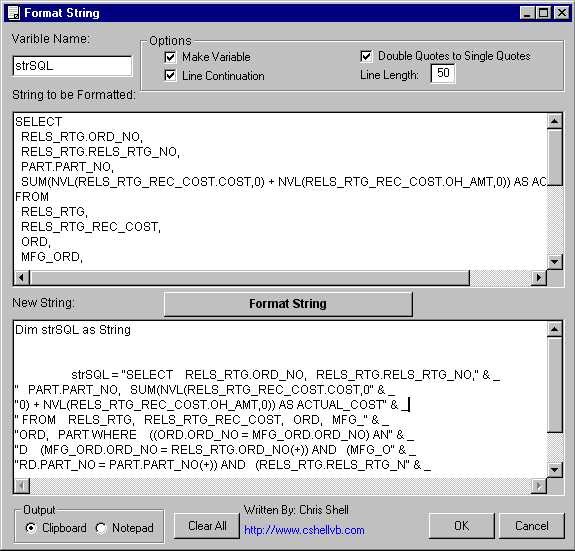



## Format SQL Strings \- Format String v1\.0

### Description

Formats SQL Strings so that they can be placed into you code quickly and easily. How many times have you spent several minutes formatting a SQL statement in your code.

You know, you get the SQL working in Access, SQLTalk, or Query Analyzer and then you need to add it to your code and make it do something. You have to store in a variable and in order to accomplish this you need to assign it to the variable. This means going line by line (and getting errors in VB) and formating the SQL statement so that it gets assigned to the variable.

With my new program you never have to do that again!

It does it all for you, check the screen shot and then start using it everyday! If you like it then vote for me and visit my site www.cshellvb.com!

There is a Tool out there that does this (I won't mention the company here) but is part of a suite and costs $299! I did not need the suite so I wrote the tool myself!
 
### More Info
 
As you will see, my code simply takes an inputed length and starts chopping it up. The result may not look like your result but most of the work is done for you and now you can touch it up.

Vote for me!

Side Effects.... Ya, you will code faster then ever before and you will never have to format those SQL statements again!

             |
---                |---
**Submitted On**   |2001-04-25 14:26:32
**By**             |[Chris Shell](https://github.com/Planet-Source-Code/PSCIndex/blob/master/ByAuthor/chris-shell.md)
**Level**          |Advanced
**User Rating**    |4.3 (30 globes from 7 users)
**Compatibility**  |VB 6\.0
**Category**       |[Complete Applications](https://github.com/Planet-Source-Code/PSCIndex/blob/master/ByCategory/complete-applications__1-27.md)
**World**          |[Visual Basic](https://github.com/Planet-Source-Code/PSCIndex/blob/master/ByWorld/visual-basic.md)
**Archive File**   |[Format SQL188254252001\.zip](https://github.com/Planet-Source-Code/chris-shell-format-sql-strings-format-string-v1-0__1-22695/archive/master.zip)

